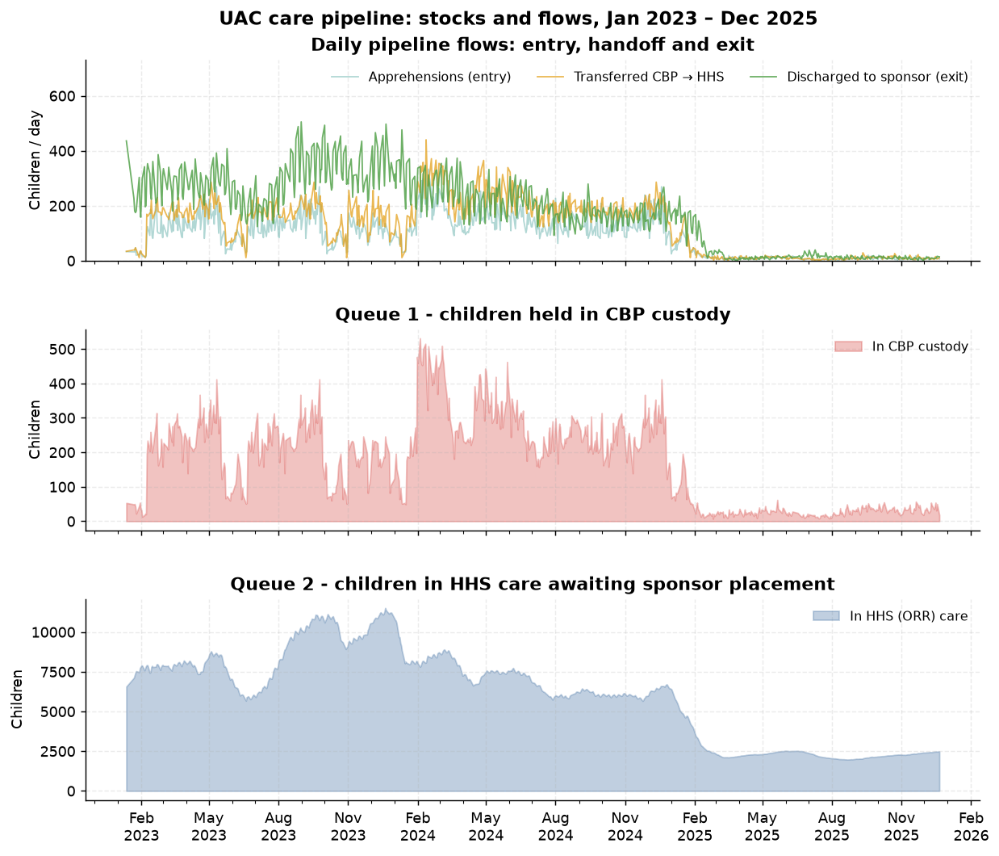
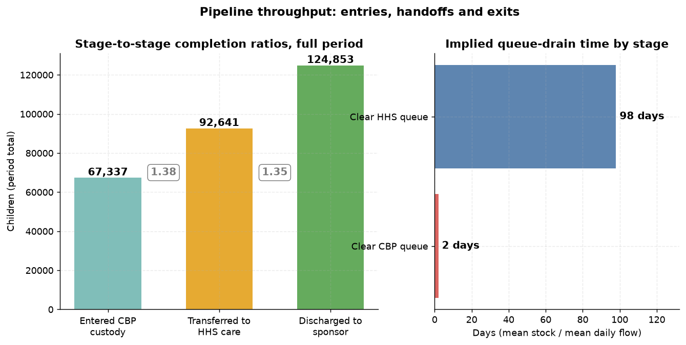
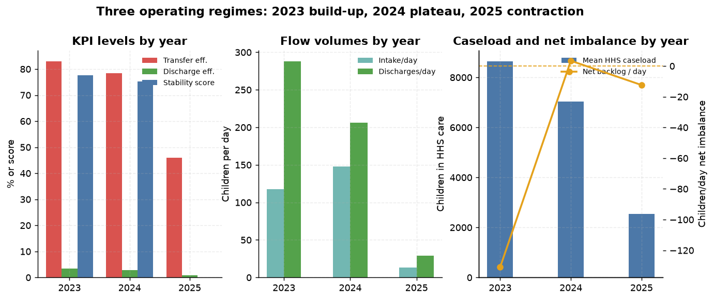
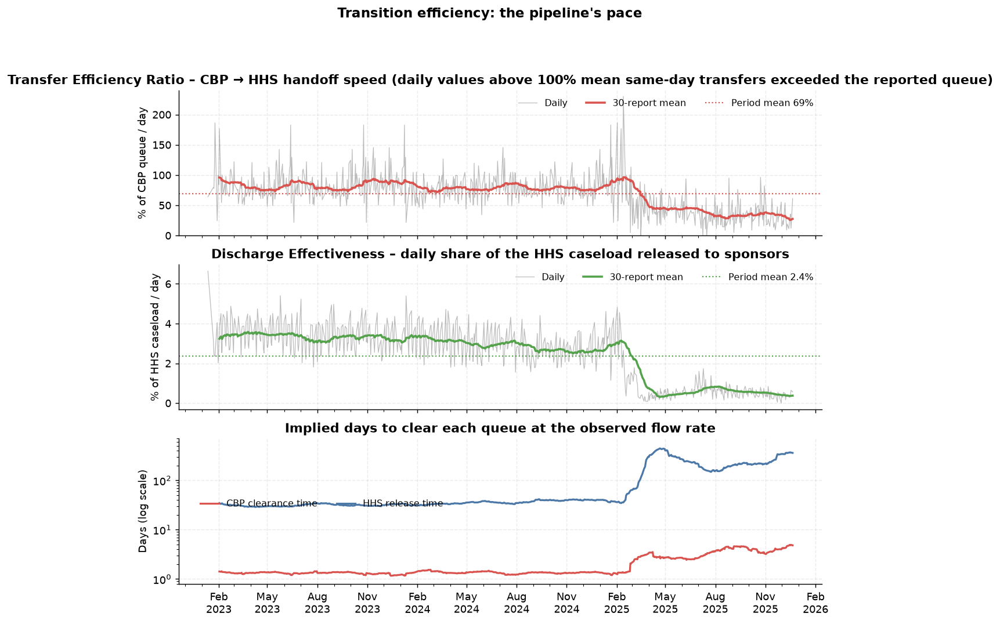
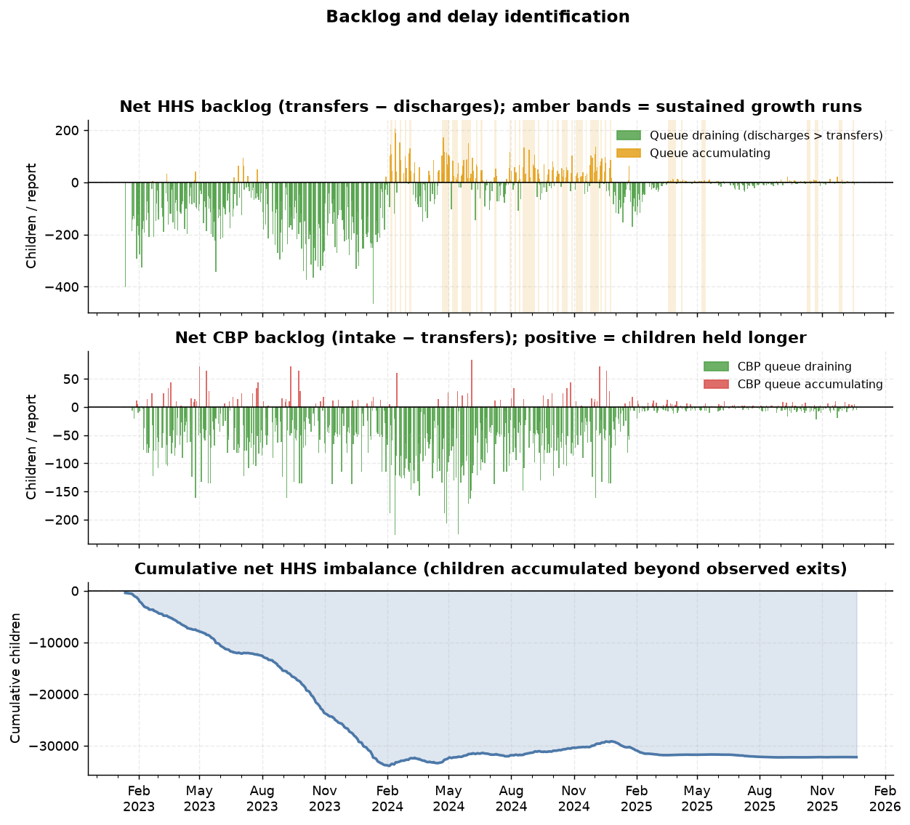
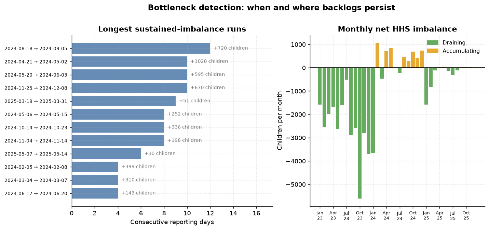
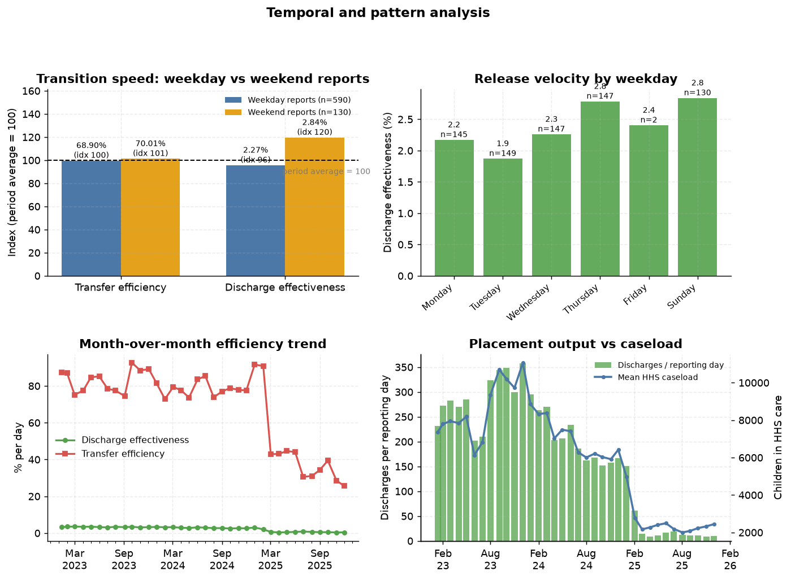
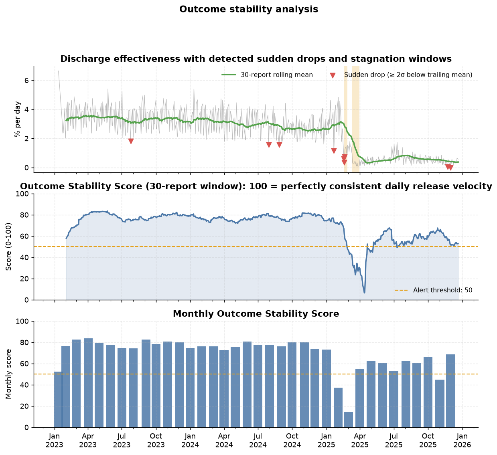

# Care Transition Efficiency & Placement Outcome Analytics

**Reframing the HHS Unaccompanied Alien Children (UAC) programme from a capacity monitor to a process-efficiency and outcome-evaluation system**

*Unified Mentor · U.S. Department of Health and Human Services — problem brief*
*Analysis period: 12 January 2023 – 21 December 2025 · 720 reporting days*

---

## Abstract

Aggregate counts of children in government custody answer *how many* children are held, but not *how well* the care pipeline moves them. This study converts the daily HHS UAC reporting file into a three-stage process model — **CBP custody → HHS (ORR) care → sponsor placement** — and measures it with five transition KPIs: Transfer Efficiency Ratio, Discharge Effectiveness Index, Pipeline Throughput, Backlog Accumulation Rate and Outcome Stability Score. On 720 reports spanning 1,075 calendar days (67% reporting coverage) the pipeline moved **67,337 apprehensions through 92,641 transfers to 124,853 sponsor placements**. Programme-wide the system clears the CBP queue in ≈2 days but needs ≈98 days to place the HHS caseload. Three regimes emerge: 2023 (fast drain, throughput 2.45×, stability 77.7), 2024 (the backlog year — 27 of 36 sustained accumulation runs, placement completion 98%, net +3.4 children/day) and 2025 (collapse of volume *and* velocity: transfer efficiency 83%→46%, discharge effectiveness 3.34%→0.90% per day, implied placement cycle 31→227 days, stability score 0). Sustained bottlenecks, prolonged stagnation windows and 445 threshold breaches are located precisely in time. The findings support a monitoring shift from counting children to measuring movement, with concrete operational, case-management and policy recommendations — and two data-governance actions without which process monitoring cannot be trusted: a published reporting guide (the flow columns do not reconcile with the stock columns in 2023, leaving ≈151 children/day unexplained) and continuous seven-day reporting (33% of calendar days are currently unobserved).

**Keywords:** care transition analytics, process efficiency, backlog detection, reunification, unaccompanied children, Streamlit dashboard.

---

## 1. Introduction

### 1.1 From capacity to process

The UAC programme is not only a healthcare and sheltering system; it is a **multi-stage care and reunification pipeline**:

> Apprehension & CBP custody → Transfer to HHS care → Medical screening, sheltering and case management → Discharge and reunification with a vetted sponsor

From a policy and humanitarian standpoint, **speed, continuity and reliability** of that pipeline matter as much as raw capacity: every additional day a child spends in a queue is a day without a family, a classroom or a stable placement. Yet public reporting has traditionally been framed around *stock* — the number of children in custody — leaving process-efficiency questions unanswered:

1. How efficiently are children transferred from CBP to HHS?
2. Are discharges keeping pace with inflows?
3. When and where do care backlogs accumulate?
4. Are placement outcomes improving or deteriorating over time?

Without structured transition analytics, bottlenecks remain hidden behind a single reassuring (or alarming) headline number.

### 1.2 Objectives

**Primary:** measure the efficiency of CBP → HHS transitions; evaluate discharge and sponsor-placement outcomes; identify delays and process bottlenecks.
**Secondary:** support faster reunification; improve case-management workflows; inform policy-level process reform.
**Deliverables:** this research paper, a live Streamlit analytics dashboard, and an executive summary for government stakeholders.

### 1.3 Contribution

The contribution is methodological and operational rather than theoretical: a reproducible conversion of a stock-oriented public dataset into **flow, ratio, backlog and stability metrics**, a detection layer for bottlenecks and sudden outcome drops, and an interactive dashboard that lets programme analysts interrogate any reporting window with threshold alerts.

---

## 2. Data

### 2.1 Source and structure

One file, `HHS_Unaccompanied_Alien_Children_Program.csv`, six columns, no identifiers:

| Column | Role in the pipeline model |
|---|---|
| Date | Reporting date |
| Children apprehended and placed in CBP custody* | System **entry flow** |
| Children in CBP custody | **Queue 1** (stock) |
| Children transferred out of CBP custody | **Handoff flow** (stage 1 → 2) |
| Children in HHS Care | **Queue 2** (stock) |
| Children discharged from HHS Care | **Exit flow** → sponsor placement |

### 2.2 Cleaning and preparation

* 1,170 physical rows → **720 populated reporting days**; 450 trailing blank rows discarded.
* Dates parsed from `"%B %d, %Y"`; thousands separators stripped (`"2,484"` → 2484); all six metrics coerced to numeric.
* Zero duplicate dates, zero negative values, zero missing values inside populated rows.
* Sorted ascending into a chronological reporting series.

### 2.3 Coverage — how observable is the process?

| Item | Value |
|---|---|
| First / last report | 2023-01-12 / 2025-12-21 |
| Calendar days in range | 1,075 |
| Reporting days | 720 (**67.0%** coverage) |
| Median gap | 1 day (559 consecutive-day pairs) |
| Longest gap | 10 days (2023-01-12 → 2023-01-22) |
| Reports following a multi-day break | 161 (22.4%) |
| Weekday counts | Tue 149, Wed 147, Thu 147, Mon 145, **Sun 130, Fri 2, Sat 0** |

Coverage is the single most important caveat in this study: **355 calendar days carry no report at all**, and the programme has effectively no Friday/Saturday reporting. Any "weekday vs weekend" statement therefore contrasts Monday–Thursday reports with Sunday reports (Section 5.3).

### 2.4 Are published flows daily counts or sums over the gap?

Before any ratio is meaningful, we must know what a flow on a Sunday preceded by a three-day gap represents. We regress each flow on the reporting gap while absorbing the programme's dramatic time trend:

`flow ~ reporting_gap + β₁t + β₂t²`

| Flow | Gap coefficient (children per extra gap day) | t | Value expected if reports summed over the gap |
|---|---|---|---|
| Discharges | **+9.71** | 4.1 | +173.4 |
| Transfers | **−0.94** | −0.4 | +128.7 |
| Intake | **−3.19** | −1.7 | +93.5 |

Gap coefficients are an order of magnitude below the period-sum expectation, so **published flows are treated as daily counts**. (The small positive discharge coefficient — about +11% on three-day-gap reports — is noted as mild weekend-inclusive counting; it is immaterial next to the 30× variation across the period, but it qualifies Section 5.3.)

---

## 3. Methodology

### 3.1 Care pipeline modelling

The programme is represented as a serial pipeline with two queues and three flows:

```
  entry                 handoff                exit
intake ──▶ [ CBP queue ] ──transfers──▶ [ HHS queue ] ──discharges──▶ sponsor placement
          (cbp_stock)                  (hhs_stock)
```

Every report contributes one observation of `(intake, cbp_stock, transfers, hhs_stock, discharges)`; derived features are computed row-wise, and window KPIs aggregate any selected date range.

### 3.2 Transition-efficiency metrics

| KPI | Formula | Interpretation |
|---|---|---|
| **Transfer Efficiency Ratio** | `transfers ÷ cbp_stock` | Share of the CBP queue handed off per report; reciprocal = days to clear |
| **Discharge Effectiveness Index** | `discharges ÷ hhs_stock` | Share of the HHS caseload released per report; reciprocal = days to place |
| **Pipeline Throughput** | `Σ discharges ÷ Σ intake` | Total exits ÷ total entries over the window |
| Handoff completion | `Σ transfers ÷ Σ intake` | Share of apprehensions that reached HHS care |
| Placement completion | `Σ discharges ÷ Σ transfers` | Share of transferred children discharged to a sponsor |
| **Backlog Accumulation Rate** | `transfers − discharges` (children/report) | Positive = HHS queue growing faster than it empties |
| Relative backlog rate | `(transfers − discharges) ÷ hhs_stock` | Scale-invariant growth rate of the queue |
| CBP net backlog | `intake − transfers` | Positive = children held in CBP longer |
| **Outcome Stability Score** | `100 × (1 − clamp(CV(discharge effectiveness), 0, 1))` | 100 = perfectly consistent release velocity |

Ratio metrics are deliberately **scale-invariant**: the 2025 caseload is an order of magnitude smaller than 2023's, so absolute counts cannot be compared across regimes but ratios can.

### 3.3 Backlog, stagnation and drop detection

* **Sustained imbalance runs** — consecutive reports in which a queue grew; runs of ≥3 reports are reported with start/end dates, length and cumulative severity (`Σ net`).
* **Stagnation periods** — ≥4 consecutive reports at which discharge effectiveness sits below **60% of its trailing 30-report median**.
* **Sudden drops** — reports at which discharge effectiveness is ≥2 trailing standard deviations below its 60-report rolling mean (a process-control *beyond-the-natural-bounds* rule).
* **Threshold alerts** — user-configurable visual alerts (default: discharge effectiveness < 1%/day, CBP clearance > 4 days, HHS release > 150 days, relative backlog > 1%/day).

### 3.4 Temporal and stability analysis

Weekday vs weekend report speed; month-over-month placement output and efficiency; rolling 30-report stability score; a mass-balance diagnostic (`Δstock − (inflow − outflow)`) quantifying movement the published columns do **not** observe.

### 3.5 Reproducibility

`src/care_pipeline.py` (library: loading, features, KPIs, detectors), `src/run_analysis.py` (figures, tables, `insights.json`), `app.py` (dashboard). One command regenerates every artefact: `python src/run_analysis.py`.

---

## 4. Exploratory analysis: three operating regimes



**Figure 1.** The three-stage care pipeline: daily flows (top), CBP queue (middle), HHS queue (bottom).



**Figure 2.** End-to-end throughput. Over the full window 67,337 apprehensions were matched by 92,641 transfers (1.38×, the CBP queue draining) and 124,853 sponsor placements (1.35× of transfers). Exits exceed entries because the programme drew down a large opening caseload; the right panel shows the asymmetry that defines this pipeline — **≈2 days to clear CBP, ≈98 days to clear HHS**.



**Figure 3.** Year-on-year regime comparison (scale-invariant KPIs on the left).

| KPI | 2023 | 2024 | 2025 |
|---|---:|---:|---:|
| Reporting days (coverage) | 230 (65.5%) | 251 (68.8%) | 239 (67.3%) |
| Transfer Efficiency Ratio | **83.0%** | 78.3% | **46.0%** |
| CBP clearance time | 1.3 d | 1.4 d | **3.3 d** |
| Discharge Effectiveness Index | **3.34%/day** | 2.90%/day | **0.90%/day** |
| Implied HHS release time (mean / median) | 31 / 31 d | 37 / 36 d | **227 / 177 d** |
| Pipeline Throughput | 2.45× | 1.39× | 2.22× |
| Placement completion | 183% | **98%** | 175% |
| Net HHS backlog | −131/day | **+3.4/day** | −12/day |
| Outcome Stability Score | 77.7 | 75.2 | **0.0** |
| Mean intake / discharges per day | 118 / 288 | 148 / 206 | 13 / 29 |
| Mean HHS caseload | 8,646 | 7,043 | 2,543 |

**Regime 1 — 2023, build-up.** Volume climbed through the year while the pipeline drained fast: throughput 2.45×, net −131 children/day, HHS caseload peaking at **11,516 on 20 December 2023**. The queues grew because *entries* grew, not because exits slowed.

**Regime 2 — 2024, plateau and backlog.** The single year in which outflow failed to keep pace: placement completion fell to **98%** and the HHS queue accumulated **+3.4 children/day on average**. Peak CBP custody (531 children, 4 February 2024) fell in the same month as the year's tightest handoff pressure.

**Regime 3 — 2025, contraction.** Intake collapsed (148 → 13 children/day) and the caseload fell 64% — but **process speed collapsed too**. Transfer efficiency fell to 46%, discharge effectiveness to 0.90%/day, and the implied placement cycle lengthened from 31 days to a median of 177 days. The stability score reached **0.0**, i.e. the coefficient of variation of daily release velocity exceeded 100%: releases became erratic rather than merely slow.

The analytical headline is that **volume and velocity moved independently**: a shrinking caseload did not translate into faster reunification.

---

## 5. Results

### 5.1 Transition efficiency



**Figure 4.** Transfer Efficiency (top), Discharge Effectiveness (middle) and the implied days-to-clear both queues (bottom, log scale).

Both ratios are flat through 2023–2024 and break sharply at the start of 2025. Programme-wide averages: **transfer efficiency 69.1%** (≈2.0 days to clear CBP) and **discharge effectiveness 2.37%/day** (≈98 days to place the caseload). The two queues differ by a factor of ~50 in drain time — the pipeline's structural constraint is the HHS stage, not the border handoff.

Cross-period comparison: transfer efficiency **83.0% → 46.0%** and discharge effectiveness **3.34% → 0.90%** (2023 → 2025). In operational terms the CBP handoff moved from a 1.3-day to a 3.3-day cycle, and sponsor placement from a 31-day to a 227-day cycle.

Two signal-quality notes: (i) daily transfer efficiency occasionally exceeds 100%, which can only happen when same-day transfers exceed the reported queue — a timing/definition artefact of the stock column, not an impossible flow; (ii) ratio variance rises as denominators shrink, so 2025 readings are noisier — hence the rolling means and stability scores shown throughout.

### 5.2 Backlog and bottleneck identification



**Figure 5.** Net HHS imbalance per report (top, amber bands = sustained runs), net CBP imbalance (middle) and the cumulative imbalance (bottom).



**Figure 6.** The twelve longest sustained-imbalance runs (left) and monthly net imbalance (right).

**36 sustained accumulation runs** were detected (34 in the HHS queue, 2 in CBP), covering **170 reports** and a cumulative net imbalance of **7,787 children**. Their concentration is extreme:

| Year | Runs | Reports inside runs | Cumulative imbalance |
|---|---:|---:|---:|
| 2023 | 0 | 0 | 0 |
| 2024 | **27** | 132 | **+7,595** |
| 2025 | 9 | 38 | +192 |

The most severe individual episodes (2024 supplies eight of the ten longest runs):

| Stage | Window | Reports | Calendar days | Net imbalance | Per day |
|---|---|---:|---:|---:|---:|
| HHS | 18 Aug – 05 Sep 2024 | 12 | 19 | **+720** | +37.9 |
| HHS | 21 Apr – 02 May 2024 | 10 | 12 | **+1,028** | +85.7 |
| HHS | 20 May – 03 Jun 2024 | 10 | 15 | +595 | +39.7 |
| HHS | 25 Nov – 08 Dec 2024 | 10 | 14 | +670 | +47.9 |
| HHS | 19 – 31 Mar 2025 | 9 | 13 | +51 | +3.9 |

2024 is unambiguously the backlog year: seven of the ten longest runs, and the only year with a positive average net imbalance. The April–May 2024 episode is the most severe on a per-day basis (+85.7 children/day for 12 days), which is precisely the pattern a monthly average hides — **+1,028 children accumulated in under two weeks while the monthly figure looked unremarkable**.

**Threshold alerts.** With the default thresholds the full period yields **445 breaches**: discharge effectiveness < 1%/day (190), HHS release time > 150 days (141), CBP clearance > 4 days (63), relative backlog > 1%/day (51). Their distribution is itself the finding:

| Alert | 2023 | 2024 | 2025 |
|---|---:|---:|---:|
| Discharge effectiveness < 1%/day | 0 | 0 | **190** |
| HHS release time > 150 days | 0 | 0 | **141** |
| CBP clearance > 4 days | 3 | 1 | **59** |
| Backlog accumulation > 1%/day | 3 | **46** | 2 |

The alert profile separates the two failure modes cleanly: **2024 failed on accumulation** (queue growth), **2025 failed on velocity** (release speed).

### 5.3 Temporal and pattern analysis



**Figure 7.** Weekday vs weekend speed (indexed), release velocity by weekday, month-over-month efficiency, and placement output against caseload.

| Day type | Reports | Discharges/day | Discharge effectiveness | Transfer efficiency | HHS release time |
|---|---:|---:|---:|---:|---:|
| Weekday (Mon–Thu, Fri) | 590 | 166.2 | 2.271% | 68.9% | 87 d |
| Weekend (Sun) | 130 | 206.1 | **2.840%** | 70.0% | 146 d |

Weekend (Sunday) reports show **25% higher discharge effectiveness** than weekday reports. A regression controlling for the reporting gap, caseload and a quadratic time trend estimates the Sunday effect at **+61.4 discharges per report (t = 9.7, R² = 0.882)** — too large to be explained by the three-day gap alone (the gap coefficient is *negative*, −6.5). Because the file contains no Saturday reports and only two Friday reports, genuine weekend placement activity cannot be separated from a wider weekend counting window; both readings are consistent with **releases being processed in weekend batches**. This should be resolved by the reporting guide (Section 7) and, if real, formalised.

Weekday variation within the week is modest (Sunday 2.8%, Thursday 2.8%, Tuesday 1.9%); note that Tuesday — the highest-volume reporting day (n = 149) — has the *lowest* release velocity, consistent with weekend releases landing in Sunday's count and Monday–Tuesday catching up.

**Month-over-month placements.** Output peaked at **358 discharges/report in December 2023** and bottomed at **8.4 in November 2025** (−97.6%). The single worst month-over-month move was **−73.4% in March 2025**. Efficiency trends show the same break: transfer efficiency fell from the 75–90% band to 26–45% between February and March 2025.

### 5.4 Outcome stability



**Figure 8.** Discharge effectiveness with detected drops and stagnation windows (top), the rolling Outcome Stability Score (middle) and monthly stability (bottom).

* **Stability by year:** 77.7 (2023) → 75.2 (2024) → **0.0 (2025)**. A score of zero means the coefficient of variation of discharge effectiveness exceeded 100%: daily releases were, in statistical terms, unstructured.
* **Weakest month:** March 2025 (score **14.4**).
* **Stagnation windows** (≥4 reports below 60% of the trailing median): **11–31 March 2025** (15 reports, 0.30%/day vs a 1.19% baseline — a 74% shortfall sustained for 21 calendar days) and **17–26 February 2025** (8 reports, 0.91% vs 2.88%).
* **Sudden drops** (≥2σ below the trailing 60-report mean): **9 detected** — 25 Jul 2023, 30 Jul and 27 Aug 2024, then a cluster in Jan–Feb 2025 (21 Jan, 17–19 Feb) and 23 & 30 Nov 2025. The February 2025 cluster coincides exactly with the first stagnation window, and the November 2025 drops coincide with the period's lowest output month.

The detectors therefore agree on a single deteriorating sequence: **first the level of release velocity falls (Jan–Feb 2025), then it becomes erratic (March 2025 stability 14.4), and it never returns to its prior band.**

### 5.5 Throughput and stage completion

Full-period stage completion was **handoff 137.6%** (transfers ÷ apprehensions) and **placement 134.8%** (discharges ÷ transfers), with overall **throughput 1.85×**. Both exceed 100% because the queues shrank over the window — the programme was emptying both stages faster than it filled them. Viewed by year, throughput falls from 2.45× (2023) to 1.39× (2024) before recovering to 2.22× (2025); the 2024 figure is the system at its least efficient, because both entry and exit flows were large while the queue still grew.

---

## 6. Data quality and observability

### 6.1 Mass-balance diagnostic

For a closed pipeline, `Δstock = inflow − outflow`. Departures quantify movement the published columns do not observe.

| Period | Observed Δ HHS | Predicted (transfers − discharges) | Residual | Per day | CBP residual/day |
|---|---:|---:|---:|---:|---:|
| 2023 | +4,664 | −30,120 | **+34,784** | **+151.2** | +39.7 |
| 2024 | −4,416 | +863 | −5,279 | −21.0 | +61.4 |
| 2025 | −3,921 | −2,955 | −966 | −4.0 | +3.4 |

In 2023 the reported flows predict a **30,120-child drawdown** of the HHS queue while the queue actually **grew by 4,664** — an unexplained +34,784 children (≈151/day, ≈1.3× the reported transfer volume). The gap is small by 2025 (−4/day), and the CBP identity closes to ±3–4/day in 2025 but not earlier. We cannot determine from public data which column is wrong: candidates include under-counted transfers in 2023, discharge counts that include intra-network movements, or stock measured at a different cut-off than flows. **Practical consequence:** within-period ratios remain valid (numerator and denominator come from the same column family and the same day), but cross-period comparisons of absolute 2023 volumes — and any attempt to reconcile "children in" with "children out" — require a published data dictionary.

### 6.2 Reporting cadence

720 reports over 1,075 days (67%), no Saturday reports, two Friday reports, a maximum 10-day blind spot, and 22.4% of reports following a multi-day break. Monitoring therefore has a structural blind spot exactly where weekend processing questions arise (Section 5.3), and any incident beginning on an unreported day will be visible only in retrospect.

### 6.3 Limitations

1. **Aggregate-only data.** No child-level records: true cohort length-of-stay, sponsor type, medical screening time, re-entry or post-discharge outcomes cannot be measured. "Release time" is a flow/stock proxy, not a tracked median.
2. **No causal identification.** Policy and enforcement changes are not modelled; the 2025 break is documented, not attributed.
3. **Small denominators in 2025.** Ratio noise rises as the caseload shrinks; rolling windows partly compensate.
4. **Cadence confounding** in weekday/weekend comparisons (Section 6.2).
5. **Definition risk** from Section 6.1 until a data dictionary exists.

---

## 7. Recommendations

### Operational (pipeline speed)

1. **Set an explicit CBP handoff service level: ≤2 days (Transfer Efficiency ≥ 60%).** Actuals: 1.3 d (2023–24) → 3.3 d (2025), with 59 clearance alerts in 2025 alone. Publish the ratio weekly by sector.
2. **Set a discharge-velocity floor: Discharge Effectiveness ≥ 2.5%/day (≈40-day placement cycle).** Every 2025 report (190/190) fell below the 1%/day alert threshold; the median 2025 cycle was 177 days.
3. **Trigger intervention on the third consecutive accumulation report.** All 36 sustained runs begin as three-day streaks; the 21 Apr–02 May 2024 run added 1,028 children in 12 days. A three-report trigger converts a two-week backlog into a same-week staffing or transport decision.

### Case management

4. **Triage the queue by implied release time.** When HHS release time exceeds 150 days (141 reports), route the longest-waiting cohort into expedited sponsor-vetting lanes — the metric already exists in the dashboard and is the difference between "few children" and "children stuck".
5. **Plan for the weekend batch.** Sunday reports carry +61 releases/day after controls. If genuine, formalise weekend placement processing and count it consistently; if it is a counting-window artefact, correct the collection so that daily velocity is not systematically misread.
6. **Review any month with a Stability Score < 50** (March 2025: 14.4) as an operational defect, not a statistical curiosity — erratic release cadence disrupts shelter staffing, transport and school enrolment downstream.

### Policy and governance

7. **Publish a reporting guide and a reconciliation rule.** Resolve the 2023 +151 children/day residual (Section 6.1); until flow and stock columns reconcile, "children in custody" and "children discharged" cannot be audited against each other.
8. **Move to seven-day reporting.** 355 calendar days are currently unobserved; the missing days are precisely the weekend, where the largest release effects appear to occur.
9. **Adopt process KPIs — not counts — as the published scorecard.** The five KPIs in Section 3.2 are scale-invariant, comparable across regimes and directly actionable; capacity counts alone would have shown "the numbers are down" in 2025 while release velocity was deteriorating six-fold.

### Monitoring architecture

10. **Operate the dashboard in weekly reviews:** select the window, apply the four thresholds, review the alert histogram and the sustained-run table, and export the KPI and alert CSVs for the record. This is exactly what the delivered Streamlit application supports.

---

## 8. Conclusion

This project reframes the UAC dataset from a capacity-monitoring lens to a **process-efficiency and outcome-evaluation lens**. Doing so changes the conclusion the data supports. A capacity view reports that the caseload fell from ~8,600 to ~2,500 children — good news. A process view shows that over the same period transfer efficiency halved (83% → 46%), discharge effectiveness fell almost four-fold (3.34% → 0.90%/day), the implied reunification cycle stretched from 31 to a median of 177 days, outcome stability fell to zero, and every one of the 190 sub-threshold reports and 141 slow-release alerts in the record occurred in 2025.

The pipeline's real constraint is visible only in ratio space: **the border handoff clears in about two days; the placement stage takes about ninety-eight**. Concentrating reform on stage 2 — with a velocity floor, a three-report accumulation trigger, weekend-batch reconciliation, seven-day reporting and a published data dictionary — is where reunification timelines are actually shortened. The accompanying dashboard makes those five checks a routine, reproducible weekly exercise rather than a bespoke analysis.

---

## Appendix A — Artefact index

| Artefact | Path |
|---|---|
| Analysis library | `src/care_pipeline.py` |
| Analysis runner (figures, tables, insights) | `src/run_analysis.py` |
| Streamlit dashboard | `app.py` |
| KPI by year | `outputs/tables/kpi_year.csv` |
| Window KPI definitions and values | `outputs/tables/kpi_overall.csv` |
| Monthly summary (36 months) | `outputs/tables/monthly.csv` |
| Weekday vs weekend | `outputs/tables/daytype.csv` |
| Sustained-imbalance runs (36) | `outputs/tables/bottlenecks.csv` |
| Stagnation periods | `outputs/tables/stagnation.csv` |
| Sudden discharge drops (9) | `outputs/tables/drops.csv` |
| Threshold alerts (445) | `outputs/tables/alerts.csv` |
| Mass-balance diagnostic | `outputs/tables/mass_balance.csv` |
| Headline findings (machine-readable) | `outputs/insights.json` |

**Reproduce:** `pip install -r requirements.txt && python src/run_analysis.py && streamlit run app.py`

---

*Prepared for government stakeholders and programme analysts. All figures and tables are regenerated from the source CSV by the scripts above; no values are hand-entered.*
